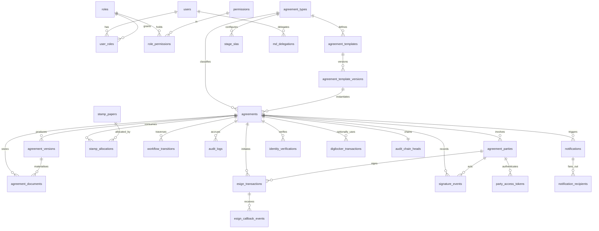

# Entity Relationship Design

**Derived from:** SDD v1.0 §7–§8 + SDD v1.1 amendments B4/B5
**Database:** PostgreSQL 16
**Convention:** all PKs are `uuid` (`gen_random_uuid()`); all timestamps are `timestamptz` stored UTC;
all monetary values `numeric(12,2)`; enums are Postgres native enum types.

---

## 1. Domain map



---

## 2. Enumerations

| Type | Values |
|---|---|
| `agreement_status` | `DRAFT`, `READY_FOR_AGENT_SIGNATURE`, `AGENT_SIGNING`, `AGENT_SIGNED`, `PENDING_EMPLOYEE_APPROVAL`, `EMPLOYEE_APPROVING`, `EMPLOYEE_APPROVED`, `PENDING_MD_SIGNATURE`, `MD_SIGNING`, `COMPLETED`, `REJECTED`, `CANCELLED`, `EXPIRED`, `SIGNATURE_FAILED` |
| `party_type` | `AGENT`, `EMPLOYEE`, `MD`, `WITNESS`, `ORGANIZATION` |
| `party_status` | `PENDING`, `NOTIFIED`, `VIEWED`, `ACTED`, `DECLINED` |
| `stamp_status` | `AVAILABLE`, `ALLOCATED`, `USED`, `CANCELLED` |
| `esign_status` | `INITIATED`, `PENDING_SIGNER`, `SIGNED`, `FAILED`, `EXPIRED`, `CANCELLED` |
| `signature_state` | `UNSIGNED`, `AGENT_SIGNED`, `EMPLOYEE_ATTESTED`, `FINAL` |
| `user_type` | `INTERNAL`, `EXTERNAL` |
| `notification_status` | `QUEUED`, `SENT`, `DELIVERED`, `BOUNCED`, `FAILED` |
| `party_access_mode` | `INTERNAL`, `EXTERNAL` |

---

## 3. Tables

### 3.1 Identity & access

**`users`** — internal accounts and external party principals.
`id`, `email` (citext, unique), `full_name`, `mobile`, `password_hash` (null for EXTERNAL),
`user_type`, `is_active`, `mfa_secret` (encrypted, null until enrolled), `mfa_enrolled_at`,
`last_login_at`, `failed_login_count`, `locked_until`, `created_at`, `updated_at`.

**`roles`** — `id`, `code` (unique: `SUPER_ADMIN`, `AGREEMENT_ADMIN`, `AGENT`, `EMPLOYEE`, `MD`, `MD_DELEGATE`, `AUDITOR`), `name`, `description`, `is_system`.

**`permissions`** — `id`, `code` (unique, `resource:action` form), `description`.

**`role_permissions`** — `role_id`, `permission_id`, PK `(role_id, permission_id)`.

**`user_roles`** — `user_id`, `role_id`, `granted_by`, `granted_at`, PK `(user_id, role_id)`.

**`md_delegations`** *(DEC-014)* — `id`, `delegate_user_id`, `appointed_by`, `valid_from`, `valid_to`, `revoked_at`, `reason`.
Constraint: `valid_to > valid_from`; exclusion constraint prevents overlapping active delegations.

**`party_access_tokens`** *(DEC-003)* — `id`, `agreement_id`, `party_id`, `token_hash` (unique — the token itself is never stored), `expires_at`, `used_at`, `issued_to_ip`, `issued_by`, `created_at`.

### 3.2 Agreement catalogue

**`agreement_types`** — `id`, `code` (unique, used in the agreement number), `name`, `description`, `party_access_mode`, `requires_identity_verification`, `requires_stamp`, `stamp_denomination`, `is_active`.

**`agreement_templates`** — `id`, `agreement_type_id`, `name`, `description`, `is_active`.

**`agreement_template_versions`** — `id`, `template_id`, `version_no`, `content` (HTML with `{{variables}}`), `variables_schema` (jsonb), `status` (`DRAFT`/`APPROVED`/`RETIRED`), `approved_by`, `approved_at`, `created_by`, `created_at`.
Unique `(template_id, version_no)`.

### 3.3 Agreement core

**`agreements`** — the aggregate root.
`id`, `agreement_number` (unique, FR-026), `agreement_type_id`, `template_version_id`,
`status` (`agreement_status`), `current_version` (int, starts 1), `stamp_type`,
`place_of_execution_state`, `verification_token` (unique, 128-bit base32, null until COMPLETED),
`party_access_mode`, `expires_at`, `data` (jsonb — template variable values),
`rejected_reason`, `rejected_by`, `rejected_at`,
`row_version` (int, optimistic concurrency), `created_by`, `created_at`, `updated_at`, `completed_at`.
Indexes: `status`, `agreement_type_id`, `created_by`, `expires_at WHERE status NOT IN (terminal)`.

**`agreement_parties`** — `id`, `agreement_id`, `party_type`, `user_id` (nullable for external),
`name`, `email`, `mobile`, `identity_reference` (masked), `signing_order`, `status` (`party_status`), `created_at`.
Unique `(agreement_id, party_type)` for `AGENT`/`EMPLOYEE`/`MD`.

**`agreement_version_history`** *(DEC-007)* — `id`, `agreement_id`, `version_no`, `status_at_close`, `rejection_reason`, `superseded_by_version`, `voided_signature_count`, `closed_at`, `created_at`.

**`workflow_transitions`** — `id`, `agreement_id`, `agreement_version`, `from_state`, `to_state`, `actor_id`, `trigger` (`USER`/`SYSTEM`/`PROVIDER_CALLBACK`/`SCHEDULER`), `reason`, `created_at`.

**`stage_slas`** *(DEC-008)* — `id`, `agreement_type_id`, `stage` (`agreement_status`), `sla_days`, `reminder_days` (int[]), `created_at`. Unique `(agreement_type_id, stage)`.

### 3.4 Stamps

**`stamp_papers`** — `id`, `stamp_number` (unique where not null), `denomination`, `state_code`, `issue_date`, `vendor`, `file_key`, `document_hash` (sha256 hex), `status` (`stamp_status`), `created_by`, `created_at`.

**`stamp_allocations`** — `id`, `stamp_paper_id`, `agreement_id`, `allocated_by`, `allocated_at`, `released_at`, `released_reason`.
**Critical constraint (DEC-009):**
```sql
CREATE UNIQUE INDEX uq_stamp_active_allocation
  ON stamp_allocations (stamp_paper_id) WHERE released_at IS NULL;
```

### 3.5 Identity (narrowed — DEC-005)

**`identity_verifications`** — `id`, `agreement_id`, `party_id`, `provider`, `provider_transaction_id`, `method` (`AADHAAR_OTP_KYC`/`DIGILOCKER`/`OFFLINE_XML`), `status`, `masked_reference`, `initiated_at`, `completed_at`, `failure_code`.
**Never stores:** Aadhaar number in clear, OTP value, or full eKYC payload.

**`digilocker_transactions`** *(deferred, DEC-017)* — `id`, `agreement_id`, `party_id`, `consent_artifact_id`, `document_uri`, `status`, `created_at`.

### 3.6 Signing

**`esign_transactions`** — `id`, `agreement_id`, `party_id`, `agreement_version`, `provider`, `provider_transaction_id` (unique per provider), `byte_range_digest`, `document_hash`, `status` (`esign_status`), `attempt_no`, `failure_code`, `signer_cert_subject`, `signer_cert_serial`, `initiated_at`, `completed_at`.

**`esign_callback_events`** *(DEC-010)* — `id`, `esign_transaction_id` (nullable — unmatched events are still recorded), `provider`, `provider_event_id` **(unique)**, `raw_payload` (jsonb), `signature_valid`, `received_at`, `processed_at`, `outcome` (`APPLIED`/`DUPLICATE`/`REJECTED_SIGNATURE`/`UNMATCHED`/`STALE`).

**`signature_events`** — per-signer lifecycle including the non-eSign Employee attestation.
`id`, `agreement_id`, `party_id`, `agreement_version`, `event_type` (`VIEWED`/`SIGN_INITIATED`/`SIGNED`/`ATTESTED`/`REJECTED`/`FAILED`), `document_hash` (the hash the actor saw), `esign_transaction_id` (null for `ATTESTED`), `ip_address`, `user_agent`, `created_at`.

### 3.7 Documents

**`agreement_versions`** — `id`, `agreement_id`, `version_no`, `signature_state`, `document_hash`, `file_key`, `supersedes_id`, `created_at`. Unique `(agreement_id, version_no, signature_state)`.

**`agreement_documents`** — `id`, `agreement_id`, `agreement_version_id`, `doc_type` (`STAMP_SCAN`/`GENERATED_UNSIGNED`/`PREPARED_UNSIGNED`/`AGENT_SIGNED`/`EMPLOYEE_ATTESTED`/`FINAL`/`AUDIT_CERTIFICATE`), `file_key`, `content_type`, `size_bytes`, `document_hash`, `created_at`.
`file_key` unique — objects are written once, never overwritten (SDD v1.1 B8 rule 1).

### 3.8 Audit & notification

**`audit_logs`** *(DEC-011)* — `id` (bigserial, monotonic), `agreement_id`, `agreement_version`, `actor_id`, `event_type`, `event_data` (jsonb), `ip_address` (inet), `user_agent`, `prev_hash`, `row_hash`, `created_at`.
Insert-only: `UPDATE`/`DELETE` revoked from the app role **and** rejected by trigger.

**`audit_chain_heads`** — `agreement_id` (PK), `head_hash`, `record_count`, `updated_at`.

**`notifications`** — `id`, `agreement_id`, `event_type` (`AGENT_SIGNED`/`EMPLOYEE_APPROVED`/`COMPLETED`/`REJECTED`/`REMINDER`), `subject`, `template_code`, `payload` (jsonb), `created_at`, `dispatched_at`.

**`notification_recipients`** — `id`, `notification_id`, `party_id`, `email`, `status` (`notification_status`), `provider_message_id`, `sent_at`, `delivered_at`, `failure_reason`, `attempt_count`.

**`outbox_events`** — transactional outbox (SDD v1.1 B9): `id`, `aggregate_id`, `event_type`, `payload` (jsonb), `created_at`, `processed_at`, `attempts`, `last_error`.

---

## 4. Key invariants enforced at the database

| Invariant | Mechanism | Rule |
|---|---|---|
| One active allocation per stamp | partial unique index | BR-006 / DEC-009 |
| One AGENT/EMPLOYEE/MD party per agreement | partial unique index on `(agreement_id, party_type)` | §4 Actors |
| Unique agreement number | unique constraint + per-FY sequence | FR-026 |
| Unique verification token | unique constraint | FR-019 |
| Callback idempotency | unique `provider_event_id` | FR-023 |
| Audit immutability | privilege revoke + trigger + hash chain | FR-025 / BR-009 |
| Document objects written once | unique `file_key` | SDD v1.1 B8 |
| No overlapping MD delegations | exclusion constraint on daterange | DEC-014 |
| Completed agreements not editable | trigger rejecting content updates when `status = 'COMPLETED'` | BR-005 |
